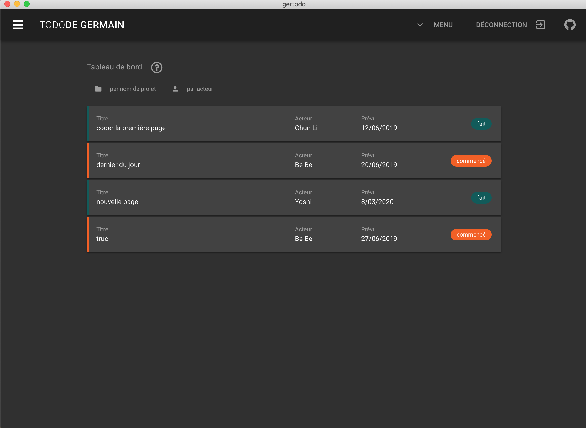

# gertodo

Un simple petit projet en Electron.
Utilisant Vue CLI, Vuetify et firebase



Le projet est toujours en cours de developpement. Vous pouvez quand même le compiler sur votre plateforme en suivant les indications qui suivent:

## Pré requis

**node** et **yarn** sur votre machine

## Configuration du projet

``` sh
yarn install
```

### Compiler en mode dev

``` sh
yarn electron:serve
```

### Compiler

``` sh
yarn electron:build
```
L'idée est d'adapter à mon goût une application todo faite en vuetify (origine: netninja) avec electron.

(**update**) j'ai ajouté le support de l'état du projet.

